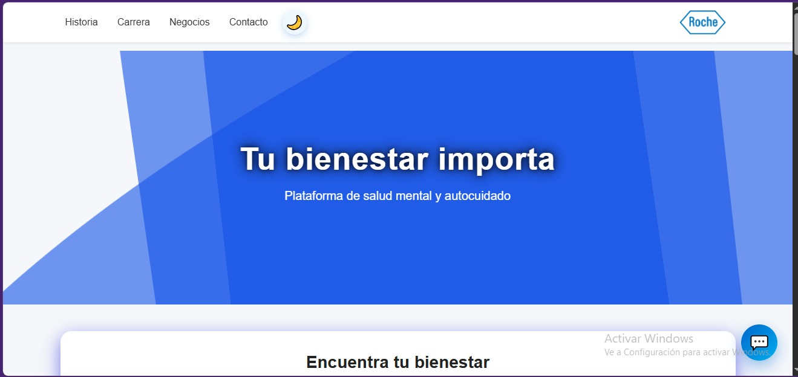

#  Roche Laboratorio - Sistema Web

Este proyecto es una plataforma web desarrollada para la gestión y visualización de servicios del **Laboratorio Roche**. Incluye una interfaz interactiva, integración con bases de datos en tiempo real y un asistente virtual (chatbot) para mejorar la experiencia del usuario.

##  Demo en Vivo
Puedes ver el proyecto desplegado aquí:
[https://leidyherrera21.github.io/ROCHE-LABORATORIOS/](https://leidyherrera21.github.io/ROCHE-LABORATORIOS/)

##  Integrantes del Grupo
* **Leidy Alomi Herrera Ramírez**
* **Ivannia Diana Nolasco Carlos**
* **Paula Cristina Rojas Chero**
* **Tabata Naomi Navidad Tupia**

> **Previsualización del Proyecto**
> 

##  Características Principales

* **Página de Inicio Dinámica:** Navegación fluida entre secciones de servicios, reconocimientos y contacto.
* **Integración con Firebase:** Gestión de datos y autenticación mediante Firebase para asegurar la integridad de la información.
* **Chatbot Inteligente:** Asistente integrado en el frontend para resolver dudas frecuentes de los usuarios de forma automática.
* **Diseño Responsivo:** Adaptado para diferentes dispositivos mediante CSS3 (incluyendo `styles.css` e `inicio.css`).

##  Tecnologías Utilizadas

* **Frontend:** HTML5, CSS3 y JavaScript (ES6+).
* **Backend/BaaS:** Firebase (Configurado en `firebase.js`).
* **Lógica de Interacción:** Scripts modulares para el chatbot, manejo de DOM y navegación.

##  Estructura del Proyecto

```text
├── index.html           # Página principal
├── roche.html           # Sección detallada del laboratorio
├── reconocimientos.html # Galería de logros y acreditaciones
├── css/
│   ├── styles.css       # Estilos globales
│   └── inicio.css       # Estilos específicos de la landing
└── js/
    ├── firebase.js      # Configuración de Firebase
    ├── chatbot.js       # Lógica del asistente virtual
    ├── app.js           # Lógica general de la aplicación
    └── inicio.js        # Scripts de la página de inicio